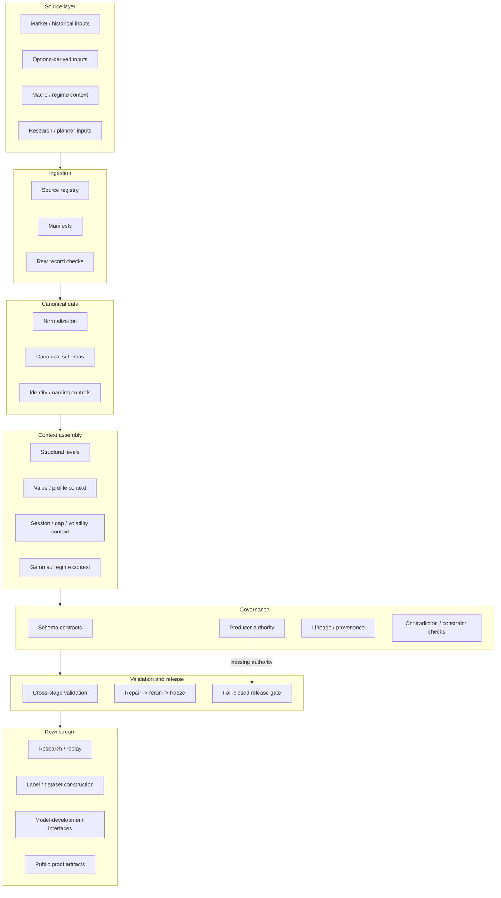

# HYDRA Architecture

## System view

## Core design ideas

### Source-accounted ingestion

A downstream record should not become "trusted" merely because a parser produced it. HYDRA keeps source identity and source scope visible through the pipeline.

### Canonicalization

Source-specific representations are normalized into stable, inspectable structures. Canonicalization is where names, fields, types, and semantic expectations become explicit.

### Contract-bound handoffs

Pipeline stages do not get permission to invent fields required by the next stage.

A downstream requirement must map to:
1. an authoritative producer;
2. an authorized derivation contract; or
3. an explicit missing-authority blocker.

### Lineage and provenance

The system treats "where did this value come from?" as a first-class question.

Observed, derived, synthetic, and assumed values must not collapse into one indistinguishable state.

### Validation and release gates

A green result is meaningful only when the test itself is honest.

HYDRA uses fail-closed behavior when the required evidence or authority is absent.

## Public boundary

This architecture document describes the public engineering model and validated design direction. It should not be used to imply that every displayed lane is live, integrated, or production deployed.

See [PUBLIC_CLAIM_BOUNDARIES.md](PUBLIC_CLAIM_BOUNDARIES.md).
